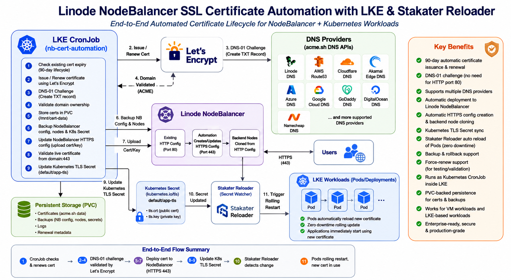

# Linode NodeBalancer Let's Encrypt SSL Automation

Enterprise-grade automation to issue, renew, validate, and safely deploy Let's Encrypt SSL certificates to:

1. Linode NodeBalancer HTTPS configuration
2. Kubernetes TLS Secret inside LKE

The automation is designed to run as a Kubernetes CronJob inside an LKE cluster while serving VM-based or Kubernetes workloads behind a Linode NodeBalancer.

---

# Architecture Diagram



---

# Features

- Fully automated Let's Encrypt certificate issuance
- Automated certificate renewal
- DNS-01 challenge based validation
- Automatic DNS TXT record creation/removal
- Automatic HTTPS NodeBalancer config creation
- Existing HTTPS config update support
- Backend node cloning from HTTP to HTTPS config
- VPC/VLAN backend support using `subnet_id`
- Kubernetes TLS Secret synchronization
- Live HTTPS certificate validation
- Automatic rollback on failure
- NodeBalancer configuration backup
- Kubernetes Secret backup
- PVC-backed persistent storage
- Kubernetes CronJob based scheduling
- Concurrency protection using file locks
- Force-renew support for testing

---

# Architecture

```text
Kubernetes CronJob
        |
        |-- Issue/Renew Let's Encrypt Certificate
        |-- Create DNS TXT Record for Validation
        |-- Validate Domain Ownership
        |-- Backup Existing NodeBalancer Config
        |-- Backup Existing Backend Nodes
        |-- Backup Existing Kubernetes TLS Secret
        |-- Create/Update HTTPS NodeBalancer Config
        |-- Clone Backend Nodes
        |-- Validate Live HTTPS Certificate
        |-- Update Kubernetes TLS Secret
        |-- Cleanup Old Backups
```

---

# Repository Structure

```text
.
├── Dockerfile
├── README.md
├── scripts/
│   └── renew-and-deploy.sh
├── manifests/
│   ├── 00-namespace.yaml
│   ├── 01-serviceaccount-rbac.yaml
│   ├── 02-secret-template.yaml
│   ├── 03-configmap.yaml
│   ├── 04-pvc.yaml
│   └── 05-cronjob.yaml
└── docs/
    ├── deployment-guide.md
    ├── rollback-guide.md
    └── security-notes.md
```

---

# How DNS Validation Works

This project uses Let's Encrypt DNS-01 validation.

During certificate issuance or renewal:

1. The automation dynamically creates a TXT record:

```text
_acme-challenge.<your-domain>
```

2. Let's Encrypt validates the TXT record.

3. After validation succeeds, the TXT record is automatically removed.

This approach avoids dependency on:
- Port 80 access
- HTTP routing
- Existing HTTPS config
- Backend server availability
- NodeBalancer path rules

This makes the solution highly reliable and production-friendly.

---

# Supported DNS Providers

Currently tested with:

- Linode DNS (`dns_linode_v4`)

Future support can easily be added for:
- Route53
- Cloudflare
- Akamai Edge DNS
- Azure DNS
- Google Cloud DNS

---

# DNS Automation Configuration

DNS provider details are configured in:

```text
manifests/02-secret-template.yaml
```

and

```text
manifests/03-configmap.yaml
```

---

# Required DNS Provider Variables

## For Linode DNS

Add the following in:

```text
manifests/02-secret-template.yaml
```

```yaml
stringData:
  LINODE_API_TOKEN: "your-linode-api-token"
  LINODE_V4_API_KEY: "your-linode-api-token"
```

---

# Required ConfigMap Settings

Update:

```text
manifests/03-configmap.yaml
```

Example:

```yaml
apiVersion: v1
kind: ConfigMap
metadata:
  name: nb-cert-automation-config
  namespace: nb-cert-automation

data:
  DOMAIN: "example.com"
  INCLUDE_WILDCARD: "false"

  ACME_DNS_PROVIDER: "dns_linode_v4"

  NODEBALANCER_ID: "123456"

  K8S_NAMESPACE: "default"
  K8S_SECRET_NAME: "app-tls"

  VALIDATION_HOST: "example.com"
  VALIDATION_PORT: "443"

  VPC_SUBNET_ID: "320227"

  BACKUP_RETENTION_COUNT: "10"
```

---

# Important Variables

| Variable | Description |
|---|---|
| DOMAIN | Primary domain name |
| INCLUDE_WILDCARD | Enable wildcard certificate |
| ACME_DNS_PROVIDER | DNS provider supported by acme.sh |
| NODEBALANCER_ID | Linode NodeBalancer ID |
| K8S_NAMESPACE | Namespace containing TLS Secret |
| K8S_SECRET_NAME | TLS Secret name |
| VALIDATION_HOST | Host used for live HTTPS validation |
| VALIDATION_PORT | HTTPS validation port |
| VPC_SUBNET_ID | Required for VPC backend node cloning |
| BACKUP_RETENTION_COUNT | Number of backup versions retained |

---

# Initial Deployment

Apply manifests:

```bash
kubectl apply -f manifests/
```

---

# Manual Test Run

Run the CronJob manually:

```bash
kubectl create job \
  --from=cronjob/nb-cert-automation \
  manual-cert-test \
  -n nb-cert-automation
```

View logs:

```bash
kubectl logs -f job/manual-cert-test -n nb-cert-automation
```

---

# Force Certificate Renewal

Normally Let's Encrypt certificates renew only near expiry.

To forcefully renew the certificate for testing:

---

## Option 1 — Temporary FORCE_RENEW via ConfigMap

Add below variable in:

```text
manifests/03-configmap.yaml
```

```yaml
FORCE_RENEW: "true"
```

Apply updated ConfigMap:

```bash
kubectl apply -f manifests/03-configmap.yaml
```

Run manual test:

```bash
kubectl create job \
  --from=cronjob/nb-cert-automation \
  manual-force-renew-test \
  -n nb-cert-automation
```

Watch logs:

```bash
kubectl logs -f job/manual-force-renew-test -n nb-cert-automation
```

After testing, remove:

```yaml
FORCE_RENEW: "true"
```

from ConfigMap.

---

## Option 2 — Patch ConfigMap Directly

Enable FORCE_RENEW:

```bash
kubectl patch configmap nb-cert-automation-config \
  -n nb-cert-automation \
  --type merge \
  -p '{"data":{"FORCE_RENEW":"true"}}'
```

Delete old job:

```bash
kubectl delete job manual-force-renew-test \
  -n nb-cert-automation \
  --ignore-not-found
```

Create new test job:

```bash
kubectl create job \
  --from=cronjob/nb-cert-automation \
  manual-force-renew-test \
  -n nb-cert-automation
```

Watch logs:

```bash
kubectl logs -f job/manual-force-renew-test -n nb-cert-automation
```

Disable FORCE_RENEW:

```bash
kubectl patch configmap nb-cert-automation-config \
  -n nb-cert-automation \
  --type json \
  -p='[{"op":"remove","path":"/data/FORCE_RENEW"}]'
```

---

# Successful Forced Renewal Logs

Example successful output:

```text
Verification finished, beginning signing.
Downloading cert.
Cert success.
Updating existing HTTPS config
Live certificate validation succeeded
Certificate automation completed successfully
```

---

# Rollback Behavior

If any step fails:

- NodeBalancer config is restored
- Newly created HTTPS config is deleted
- Kubernetes TLS Secret is restored
- Logs and backups are preserved

---

# Persistent Storage

The PVC stores:

```text
/mnt/cert-data
/mnt/backups
```

This ensures:
- ACME account persistence
- Certificate persistence
- Backup retention
- Renewal metadata persistence

---

# Security Notes

- Use limited-scope Linode API tokens
- Restrict Kubernetes RBAC
- Store secrets only in Kubernetes Secrets
- Avoid exposing PVC externally
- Rotate API tokens periodically

---

# Kubernetes Secret Validation

Validate TLS secret:

```bash
kubectl get secret app-tls
```

Describe secret:

```bash
kubectl describe secret app-tls
```

---

# Validate HTTPS Certificate

```bash
openssl s_client -connect example.com:443 -servername example.com
```
---

# DNS Provider Configuration Reference

This automation uses `acme.sh` DNS hooks. The value of `ACME_DNS_PROVIDER` in `manifests/03-configmap.yaml` must match the DNS hook name supported by `acme.sh`.

The required DNS credentials must be added in `manifests/02-secret-template.yaml`.

Reference: `acme.sh` supports DNS API automation for many DNS providers, and the DNS hook name is passed using `--dns <provider>`. For example, Route53 uses `dns_aws`, Cloudflare uses `dns_cf`, and Linode uses `dns_linode_v4`.  [oai_citation:0‡GitHub](https://github.com/acmesh-official/acme.sh?utm_source=chatgpt.com)

---

## Linode DNS

### manifests/03-configmap.yaml

```yaml
ACME_DNS_PROVIDER: "dns_linode_v4"
```

### manifests/02-secret-template.yaml

```yaml
stringData:
  LINODE_API_TOKEN: "your-linode-api-token"
  LINODE_V4_API_KEY: "your-linode-api-token"
```

---

## AWS Route53

Use this when customer DNS zone is hosted in AWS Route53.

### manifests/03-configmap.yaml

```yaml
ACME_DNS_PROVIDER: "dns_aws"
```

### manifests/02-secret-template.yaml

```yaml
stringData:
  LINODE_API_TOKEN: "your-linode-api-token"
  AWS_ACCESS_KEY_ID: "your-aws-access-key-id"
  AWS_SECRET_ACCESS_KEY: "your-aws-secret-access-key"
```

Optional, only if using temporary STS credentials:

```yaml
  AWS_SESSION_TOKEN: "your-aws-session-token"
```

---

## Cloudflare DNS

### manifests/03-configmap.yaml

```yaml
ACME_DNS_PROVIDER: "dns_cf"
```

### manifests/02-secret-template.yaml

Preferred API token method:

```yaml
stringData:
  LINODE_API_TOKEN: "your-linode-api-token"
  CF_Token: "your-cloudflare-api-token"
  CF_Account_ID: "your-cloudflare-account-id"
  CF_Zone_ID: "your-cloudflare-zone-id"
```

`CF_Zone_ID` is optional in some setups, but recommended when you know the exact zone.

Legacy API key method:

```yaml
stringData:
  LINODE_API_TOKEN: "your-linode-api-token"
  CF_Key: "your-cloudflare-global-api-key"
  CF_Email: "your-cloudflare-account-email"
```

---

## Akamai Edge DNS

### manifests/03-configmap.yaml

```yaml
ACME_DNS_PROVIDER: "dns_akamai"
```

### manifests/02-secret-template.yaml

```yaml
stringData:
  LINODE_API_TOKEN: "your-linode-api-token"
  AKAMAI_HOST: "your-akamai-host"
  AKAMAI_CLIENT_TOKEN: "your-akamai-client-token"
  AKAMAI_CLIENT_SECRET: "your-akamai-client-secret"
  AKAMAI_ACCESS_TOKEN: "your-akamai-access-token"
```

---

## DigitalOcean DNS

### manifests/03-configmap.yaml

```yaml
ACME_DNS_PROVIDER: "dns_dgon"
```

### manifests/02-secret-template.yaml

```yaml
stringData:
  LINODE_API_TOKEN: "your-linode-api-token"
  DO_API_KEY: "your-digitalocean-api-token"
```

---

## GoDaddy DNS

### manifests/03-configmap.yaml

```yaml
ACME_DNS_PROVIDER: "dns_gd"
```

### manifests/02-secret-template.yaml

```yaml
stringData:
  LINODE_API_TOKEN: "your-linode-api-token"
  GD_Key: "your-godaddy-api-key"
  GD_Secret: "your-godaddy-api-secret"
```

---

## Google Cloud DNS

### manifests/03-configmap.yaml

```yaml
ACME_DNS_PROVIDER: "dns_gcloud"
```

### manifests/02-secret-template.yaml

```yaml
stringData:
  LINODE_API_TOKEN: "your-linode-api-token"
  GCE_PROJECT: "your-gcp-project-id"
  GCE_SERVICE_ACCOUNT_FILE: "/path/to/service-account.json"
```

For Kubernetes usage, mount the service account JSON as a Secret volume and point `GCE_SERVICE_ACCOUNT_FILE` to that mounted file path.

---

## Azure DNS

### manifests/03-configmap.yaml

```yaml
ACME_DNS_PROVIDER: "dns_azure"
```

### manifests/02-secret-template.yaml

```yaml
stringData:
  LINODE_API_TOKEN: "your-linode-api-token"
  AZUREDNS_SUBSCRIPTIONID: "your-azure-subscription-id"
  AZUREDNS_TENANTID: "your-azure-tenant-id"
  AZUREDNS_APPID: "your-azure-app-client-id"
  AZUREDNS_CLIENTSECRET: "your-azure-client-secret"
```

---

## Namecheap DNS

### manifests/03-configmap.yaml

```yaml
ACME_DNS_PROVIDER: "dns_namecheap"
```

### manifests/02-secret-template.yaml

```yaml
stringData:
  LINODE_API_TOKEN: "your-linode-api-token"
  NAMECHEAP_USERNAME: "your-namecheap-username"
  NAMECHEAP_API_KEY: "your-namecheap-api-key"
```

---

# Important Notes

1. `LINODE_API_TOKEN` is always required because this automation updates the Linode NodeBalancer.
2. DNS provider credentials are additionally required for DNS-01 validation.
3. The DNS provider token must have permission to create and delete TXT records.
4. For production, use least-privilege API tokens.
5. Do not commit real credentials to GitHub.
6. If your DNS provider is not listed here, check the `acme.sh` DNS API list and use the provider-specific hook name and environment variables.

---

# Production Recommendations

Recommended:
- Dedicated namespace
- Dedicated PVC
- Backup PVC snapshots
- Monitoring and alerting
- Separate staging/testing environment
- DNS provider token with minimum permissions

---

# License

MIT
